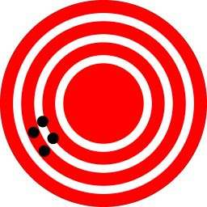
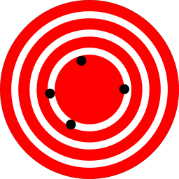
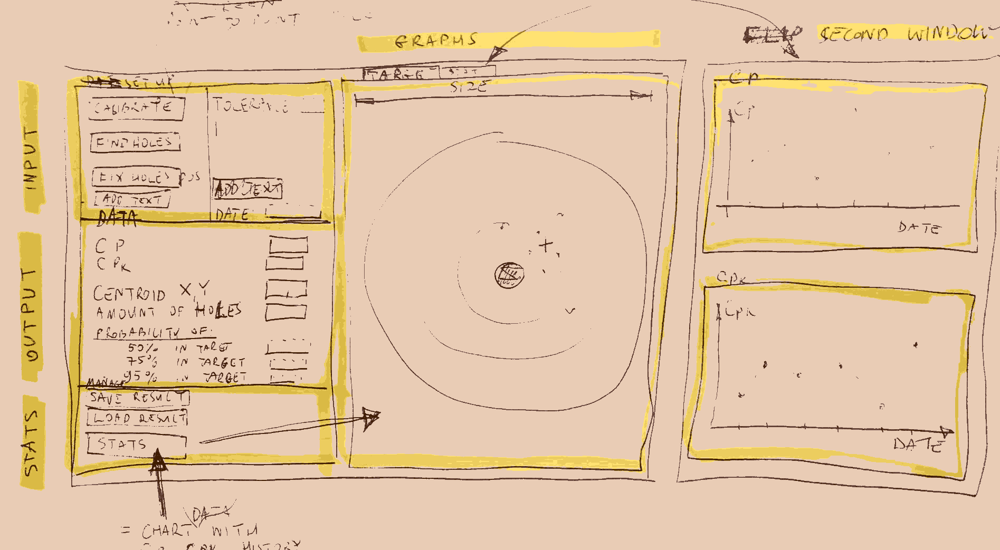

date: 2019-11-06, last modification 2019-11-18  
tags: [Python, shooting, sport shooting, Cp, Cpk, process capability index, precision, accuracy, measuring]

# Cp and Cpk for Target Shooters

When shooting to target there are two main indicators of how good is your shooting:

1. Precision - the ability to hit the same place over and over. This gives you shot dispersion which I am going to measure with	 Cp index


Source: public domain

2. Accuracy - is the proximity of results to the center point. I am going to measure it with Cpk index


Source: public domain

### The Project

The project is to calculate precision and accuracy based on bullet holes on target.  
You are scanning or a take photo of a target, mark holes (how about primary hole recognition?) and the program calculates Cp and Cpk for you. **Centroid** (average position of all the holes) is shown on the target.

### Cp and Cpk

TODO

### Calculating centroid

Measurement is to be set as the distance from the center to the default place.  
Then we calculate holes position as a list of lists: 

h1 = [x, y], h2 = [x, y], ... hn = [x,y]  
h2 = ...  
...    
hn = ...  

holes = [h1, h2, ..., hn]

and centroid is calculated:

```python
x = [h[0] for h in holes]
y = [h[1] for h in holes]  #  or x, y = zip(*holes)

centroid = [sum(x) / len(holes), sum(y) / len(holes)]
```

### Calculating Cp and Cpk

*Cp:*

(USL - LSL) / (6 * sigma).  
USL is Upper Specification Limit.  
LSL is Lower Specification Limit.  
(USL - LSL) is a range of accepted values. Here it is equal to the tolerance.  
Six Sigma means six standard deviations.  

(math equitation should be here)

*Cpk:*

(math equitation instead of code here)

```python
def calculate_cpk(tolerance, sd, centroid):
    usl = tolerance / 2 
    lsl = -(tolerance / 2)
    return min((usl - abs(complex(centroid[0], centroid[1])) / (3 * sd), abs(complex(centroid[0], centroid[1])) - lsl / (3 * sd)))
```

*6 * sigma:*

I made approximation that sigma is standard deviation, thus it is calculated as:
(math equitation will be here instead of code): 

```python
total = 0
for i in holes:
	total += math.pow((abs(complex(i[0] - centroid[0], i[1] - centroid[1]))), 2)
sixsigma =  math.sqrt(total / len(holes))
```	

### Visualization

The window is divided on two parts:

1. Setup / Data / Manage



Setup is build of:

- calibrate: button for target calibration (diameter of the target)
- scan: imports scanned target (missed on the drawing)
- find holes: tries to mark holes automatically 
- fix holes: you can fix and enter holes by hand
- tolerance: dispersion you are trying to reach
- add text: any notes you would like to add
- date

Data is build of:

- Cp: which gives info about your precision
- Cpk: which gives info about your accuracy
- Centroid X, Y: coordinates where is the middle of your shooting
- Number of holes
- Probability: based on standard deviation, probability that you shoot withing the tolerance

Stats are build of:

- save result
- load result
- stats: manage all your previous results 

2. Target or Cp/Cpk charts (flipped by upper tabs)

In this window, you can flip between target view and history results.

### Data gathering

Cp and Cpk are gathered and put on the chart to show target shooting progress. 

I am a newbie in shooting, dispersion analysis and programming. Feel free to correct my mistakes and give some constructive tips.
